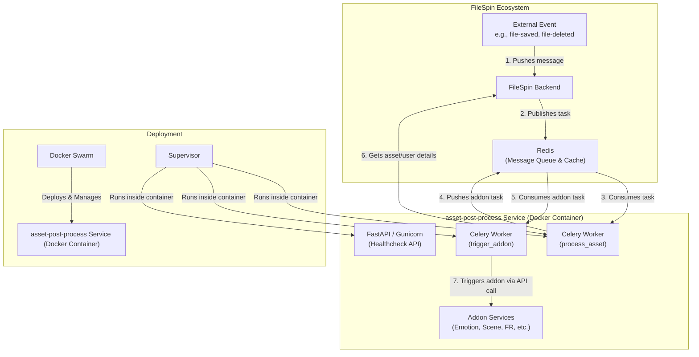

Architecture of filespin-asset-post-process
This document outlines the architecture of the filespin-asset-post-process service.

Overview
The service is a decoupled, event-driven microservice built on a task queue architecture. Its primary responsibility is to orchestrate post-processing tasks on assets by reacting to events and delegating the actual work to other specialized "addon" services.

Architecture Diagram

Workflow Explanation
Event Trigger: An event (like a file being saved, updated, or deleted) occurs in the main FileSpin application. The backend then pushes a task message into a Redis queue. The message contains the asset_id, an encrypted apikey, the event_type, and other relevant data.
Task Consumption: A Celery worker, specifically the asset-post-process-worker, consumes this initial task message from Redis.
Data Fetching & Validation: The worker executes the process_asset task. It decrypts the API key and makes API calls back to the FileSpin backend to get full asset details and the user's settings. It then validates which addons should be triggered based on the user's settings, the asset's properties (like content_type), and the event type.
Addon Task Dispatch: For each addon that meets the validation criteria, the process_asset task dispatches a new, more specific task back into a different Redis queue (taskq_filespin-trigger-addon.service). This new message contains all the info needed to trigger just one specific addon.
Addon Task Consumption: A second type of Celery worker, the asset-post-process-worker-trigger, consumes this addon-specific task message.
Delegation via API Call: This worker executes the trigger_addon task. It reads the addon name from the message and makes a final API call to the relevant addon microservice (e.g., the Emotion Recognition API). This act of making an API call delegates the actual, specialized work to another service.
Components
FastAPI: A modern Python web framework used to provide a minimal API. Its primary purpose here is to expose a /healthcheck endpoint that Docker Swarm uses to verify the service is running correctly.
Celery: The distributed task queue system that forms the backbone of the asynchronous architecture. It manages the workers that process jobs from the Redis queue.
Redis: Serves two critical functions: it's the message broker that holds tasks for Celery, and it's also used as a cache to store user settings and asset data, reducing the need for repeated API calls.
Gunicorn: A production-grade web server gateway interface (WSGI) server used to run the FastAPI application inside the container.
Supervisor: A process control system. Since a single container needs to run multiple processes (Gunicorn for the API, plus multiple Celery workers), Supervisor is used to manage and monitor them all.
Docker & Docker Swarm: The entire application is containerized with Docker for portability and scalability. It is deployed and orchestrated using Docker Swarm, which manages services, replicas, and health checks.
